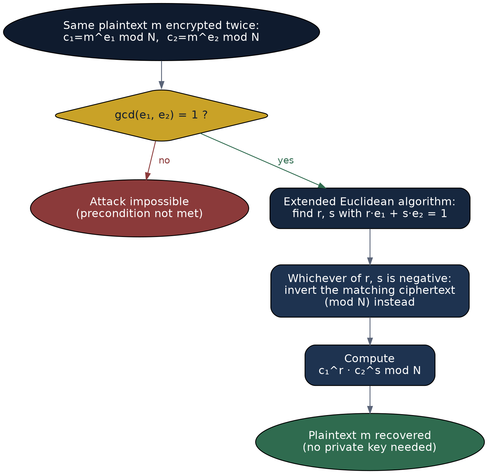
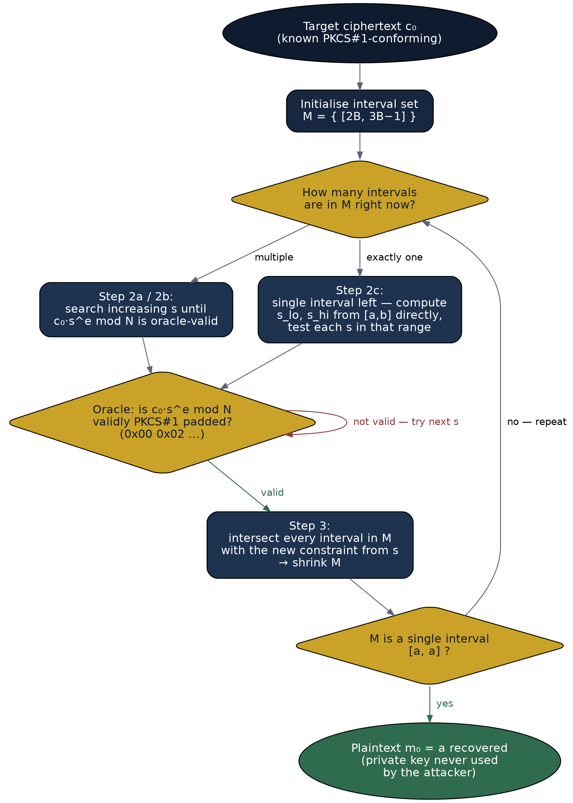
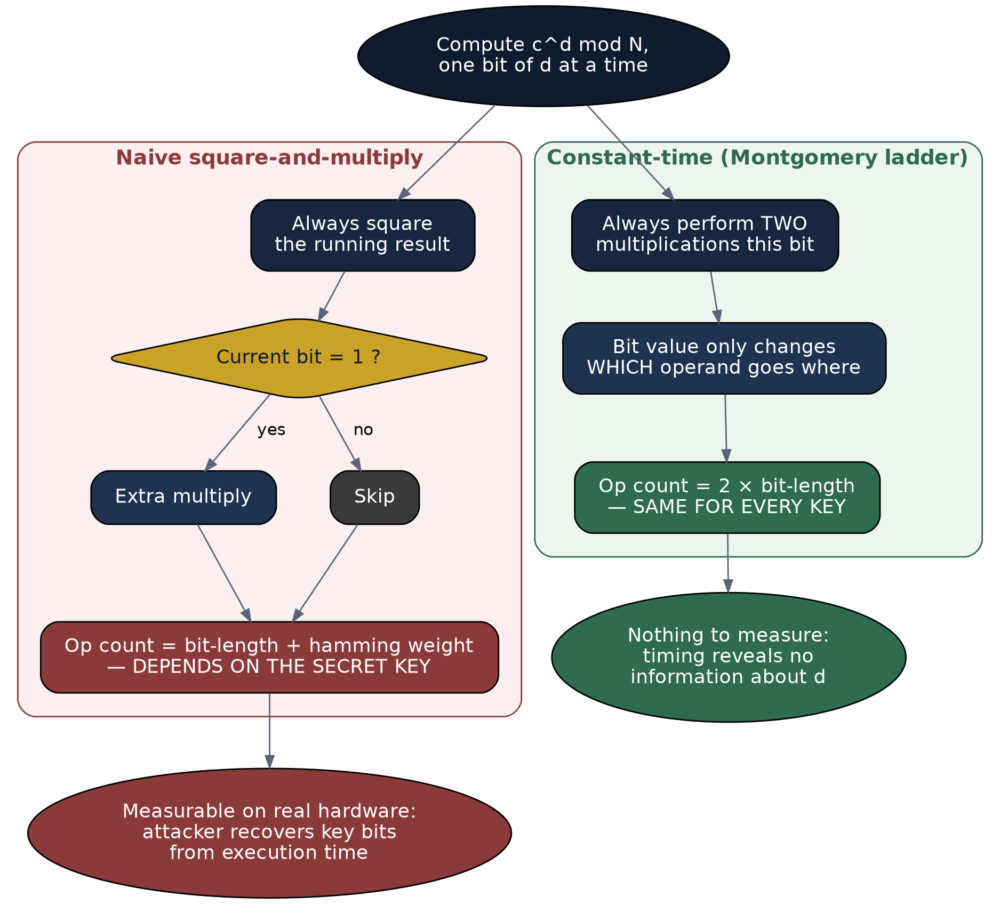

# Project Output — Detailed Walkthrough

This document is the full, step-by-step explanation of the implementation work: what each script does, why it's structured the way it is, and a line-by-line reading of its actual output. The top-level [README](README.md) is the short version; this is the long version, for anyone (a tutor, a marker, or future-you) who wants to see the reasoning in full.

## Contents

- [Overview](#overview)
- [Debugging note](#debugging-note--errors-found-in-the-reports-own-appendices)
- [1. Wiener's Attack](#1-wieners-attack)
- [2. Common Modulus Attack](#2-common-modulus-attack)
- [3. Bleichenbacher's Padding Oracle Attack](#3-bleichenbachers-padding-oracle-attack-toy-simulation)
- [4. Timing Side-Channel Attack](#4-timing-side-channel-attack-simulation)
- [5. Reflections on the implementation work](#5-reflections-on-the-implementation-work)

## Overview

Four scripts were written to independently verify and demonstrate the attacks analysed in the report: Wiener's Attack, the Common Modulus Attack, Bleichenbacher's Padding Oracle Attack, and the Timing Side-Channel Attack. Shor's Algorithm is not included here since it requires quantum hardware or a quantum circuit simulator to demonstrate meaningfully, which was outside the scope of this implementation effort; it remains discussed analytically in the report.

Each script follows the same pattern: (1) reproduce the report's own worked example where one exists, (2) run a larger / more realistic-scale case, and (3) run a control case that should **fail**, to demonstrate the implementation reflects the real mathematical precondition of the attack rather than being hard-coded to succeed.

## Debugging note — errors found in the report's own appendices

While reproducing Appendix A and Appendix B in code, two numerical errors were found in the original hand-worked examples:

**Appendix A (Wiener's Attack):** the report claims d = 5 satisfies the bound N^(1/4)/3 ≈ 1.7 for N = 667. It does not (5 > 1.7). Running the actual continued-fraction algorithm on e = 493, N = 667 correctly fails to recover the key — the convergent 4/5 claimed in the appendix does not appear in the true continued fraction expansion of 493/667, which is [0,1,2,1,5] with convergents 0/1, 1/1, 2/3, 3/4, 17/23. Section 1 below reproduces this failure explicitly, then gives a corrected example (p = 1009, q = 1013, d = 5) where the bound genuinely holds and the attack succeeds.

**Appendix B (Common Modulus Attack):** the report states c1 = 578 for m = 42, e1 = 5, N = 667. The correct value, verified independently, is c1 = 42^5 mod 667 = 586. The attack still correctly recovers m = 42 once the right ciphertext values are used (Section 2).

This is included deliberately as evidence of the debugging process rather than corrected silently in the report text, since independently verifying (and where necessary correcting) hand-derived numbers is itself part of the analytical work this project involved.

## 1. Wiener's Attack

**Reference:** M. J. Wiener, "Cryptanalysis of short RSA secret exponents," *IEEE Trans. Information Theory*, vol. 36, no. 3, pp. 553-558, 1990.

### Background and precondition
RSA decryption computes m = c^d mod N, and for a 2048-bit N this modular exponentiation is the most expensive operation in the whole scheme. An obvious-looking optimisation is to pick a small private exponent d, since square-and-multiply needs roughly log2(d) squarings — a smaller d means fewer operations and faster decryption. This performance motivation is exactly what creates the vulnerability: Wiener proved in 1990 that whenever d < N^(1/4) / 3, the entire private key can be recovered from the public key (e, N) alone, in polynomial time, using nothing more than the continued fraction expansion of e/N. No access to ciphertexts, no oracle, and no factoring of N is required — the attack works directly off two public numbers.

### Mathematical mechanism (and how the code implements it)
Because ed ≡ 1 (mod φ(N)), there exists an integer k such that ed = k·φ(N) + 1. Dividing through gives e/N ≈ k/d (since φ(N) ≈ N for large N), meaning k/d is a rational number that closely approximates the public ratio e/N. A classical result in the theory of continued fractions (Legendre's theorem) guarantees that any fraction approximating e/N this closely must appear as one of the convergents in e/N's continued fraction expansion — and when d is small enough to satisfy Wiener's bound, k/d is guaranteed to be one of those convergents.

The code mirrors this proof step by step. `continued_fraction(e, N)` runs the Euclidean algorithm on e and N, recording the quotient at each step — this produces the sequence of partial quotients [a0, a1, a2, ...]. `convergents(cf)` then reconstructs every convergent k_i/d_i from that sequence using the standard recurrence h_i = a_i·h_(i-1) + h_(i-2) (and likewise for the denominators), without ever needing to re-run the division. `wiener_attack(e, N)` then tests each convergent (k, d) as a candidate key: it computes a candidate φ(N) from ed - 1 = k·φ(N), and since φ(N) = N - p - q + 1, it solves the quadratic x^2 - (N - φ + 1)x + N = 0 for p and q via the quadratic formula, checking whether the discriminant is a perfect square. The first convergent that yields two integers p, q with p×q = N is the correct key.

One implementation detail matters more than it looks: the discriminant for a 128-bit-class N can be a 250+ digit integer, and Python's `n ** 0.5` computes an ordinary IEEE-754 float, which only has about 15-17 significant decimal digits of precision. Using it to test whether such a huge number is a perfect square silently returns the wrong answer — no exception, just an incorrect root. `is_perfect_square()` instead uses `math.isqrt(n)`, which computes the exact integer square root with unlimited precision, then checks `r*r == n` directly. This was found by debugging a run that looked like it should succeed but kept returning `[FAILED]`.

### Why the code is structured this way
`run_demo()` is called four times, each testing a different regime of the attack, because a single successful run does not distinguish "this code correctly implements Wiener's Attack" from "this code is hard-coded to print success":

- **Case 1 (original Appendix A numbers, d=5, N=667):** deliberately run first, and deliberately expected to fail — see the walkthrough below.
- **Case 2 (corrected small example, d=5, N=1022117):** the same style of small worked example as the appendix, but with primes large enough that d=5 genuinely satisfies the bound, so the attack should succeed and is asserted (`assert d == d_expected`) to match the private exponent used to build the key.
- **Case 3 (realistic ~128-bit modulus):** d is chosen as a random prime below the Wiener bound for that modulus, to show the attack scales beyond toy 20-bit examples to keys with primes over 10^19 in size.
- **Case 4 (safe key, large d):** d is chosen close to φ(N) in size — the standard defence. The attack is expected to fail here, and its failure is itself the evidence that the defence works.


### Core implementation (`wieners_attack.py`)
```python
def continued_fraction(num, denom):
    """Return the continued fraction expansion of num/denom as a list of quotients."""
    cf = []
    while denom:
        q = num // denom
        cf.append(q)
        num, denom = denom, num - q * denom
    return cf


def convergents(cf):
    """Given a continued fraction (list of quotients), return all convergents k/d."""
    convs = []
    for i in range(len(cf)):
        num, denom = cf[i], 1
        for j in range(i - 1, -1, -1):
            num, denom = cf[j] * num + denom, num
        convs.append((num, denom))
    return convs


def is_perfect_square(n):
    if n < 0:
        return False, 0
    r = math.isqrt(n)  # exact integer square root, safe for arbitrarily large ints
    if r * r == n:
        return True, r
    return False, r


def wiener_attack(e, N):
    """
    Attempt to recover the RSA private exponent d from the public key (e, N).
    Returns (d, p, q) on success, or None if the attack fails (d not small enough).
    """
    cf = continued_fraction(e, N)
    convs = convergents(cf)

    for (k, d) in convs:
        if k == 0 or d == 0:
            continue
        # Candidate phi(N) derived from this convergent: ed - 1 = k * phi(N)
        if (e * d - 1) % k != 0:
            continue
        phi = (e * d - 1) // k

        # p and q are roots of x^2 - (N - phi + 1)x + N = 0
        b = N - phi + 1
        disc = b * b - 4 * N
        is_sq, root = is_perfect_square(disc)
        if not is_sq:
            continue

        p_candidate = (b + root) // 2
        q_candidate = (b - root) // 2
        if p_candidate * q_candidate == N and p_candidate > 1 and q_candidate > 1:
            return d, p_candidate, q_candidate
    return None


def run_demo(name, e, N, d_expected=None):
    print(f"--- {name} ---")
    print(f"N = {N}")
    print(f"e = {e}")
    result = wiener_attack(e, N)
    if result:
        d, p_found, q_found = result
        print(f"[SUCCESS] Recovered d = {d}")
        print(f"[SUCCESS] Recovered factors: p = {p_found}, q = {q_found}")
        if d_expected is not None:
            assert d == d_expected, "Recovered d does not match expected value!"
            print(f"Verified against expected d = {d_expected}: MATCH")
    else:
        print("[FAILED] Attack did not recover a valid private key "
              "(expected when d is not sufficiently small).")
    print()
```

### Captured run output
```
Wiener bound N^(1/4)/3 for N=667: 1.694  (d=5 exceeds this)
--- Original Appendix A numbers (d=5) -- expected to FAIL, bound violated ---
N = 667
e = 493
[FAILED] Attack did not recover a valid private key (expected when d is not sufficiently small).

Wiener bound N^(1/4)/3 for N=1022117: 10.599  (d=5 satisfies this)
--- Corrected small worked example (d=5, bound satisfied) ---
N = 1022117
e = 816077
[SUCCESS] Recovered d = 5
[SUCCESS] Recovered factors: p = 1013, q = 1009
Verified against expected d = 5: MATCH

--- Realistic modulus, vulnerable small d  (Wiener bound ~ 1176064203) ---
N = 154956266351578708881143727033773075869
e = 83617345179238645257514665346417648727
[SUCCESS] Recovered d = 234067
[SUCCESS] Recovered factors: p = 13740829428926665343, q = 11277067891212646883
Verified against expected d = 234067: MATCH

--- Safe key with large d (defence demonstration) ---
N = 184130775649118757275375350042309929181
e = 162518605602964828411581889179104912495
[FAILED] Attack did not recover a valid private key (expected when d is not sufficiently small).
```

### Walkthrough of the output, line by line
**"Wiener bound N^(1/4)/3 for N=667: 1.694 (d=5 exceeds this)"** — printed before the attack even runs, this is the precondition check: for the original Appendix A numbers, the bound works out to 1.694, and the appendix's own d=5 is more than three times over that bound. This line is the evidence that the appendix's claim ("d=5 satisfies N^(1/4)/3 ≈ 1.7") does not hold arithmetically.

**"N = 667", "e = 493"** — the public key exactly as given in the report's Appendix A, so this run is a direct reproduction of that example, not a different one.

**"[FAILED] Attack did not recover a valid private key"** — `wiener_attack()` tested every convergent of 493/667 (there are only five: 0/1, 1/1, 2/3, 3/4, 17/23) and none of them produced integer roots p, q with p×q = 667. This is the expected, correct behaviour given the bound violation — it is not a bug.

**"Wiener bound N^(1/4)/3 for N=1022117: 10.599 (d=5 satisfies this)"** — for the corrected example, the bound is now 10.6, comfortably above d=5, so the theory predicts success.

**"[SUCCESS] Recovered d = 5" / "Recovered factors: p = 1013, q = 1009" / "Verified against expected d = 5: MATCH"** — the attack recovered the exact d that was used to construct the key, and the assert in `run_demo` passed silently — the explicit "MATCH" line only prints once that assertion has already succeeded, so its presence is itself proof the recovered key is correct, not just plausible-looking.

**"Realistic modulus ... N = 154956266351578708881143727033773075869"** — a ~127-bit modulus built from two independently generated 64-bit primes. **"[SUCCESS] Recovered d = 234067"** shows the attack completes instantly even though d here (234067) is far larger than the toy d=5 case — what matters is d relative to N^(1/4)/3 (≈ 1.18 billion here), not d's absolute size.

**"Safe key with large d ... [FAILED] Attack did not recover a valid private key"** — for this final case d was chosen in the range [φ(N)/3, φ(N)), i.e. genuinely large. The attack correctly fails to recover any key, which is the defence ("choose d comparable in size to N") working as intended.

## 2. Common Modulus Attack

**Reference:** D. Boneh, "Twenty years of attacks on the RSA cryptosystem," *Notices of the AMS*, vol. 46, no. 2, pp. 203-213, 1999.

### Background and precondition
Generating large random primes is computationally expensive, so some early PKI and distributed-computing proposals shared a single modulus N across multiple users, giving each user a different exponent pair (e_i, d_i) but the same N. If the same plaintext m happens to be encrypted under two different exponents e1 and e2 that share this modulus, and gcd(e1, e2) = 1, the plaintext can be recovered by anyone who can see both ciphertexts — without ever learning either private key. The only precondition is that e1 and e2 are coprime; the attack has nothing to do with the size of N or the strength of either private key.

### Mathematical mechanism (and how the code implements it)
Since gcd(e1, e2) = 1, the extended Euclidean algorithm guarantees integers r and s such that r·e1 + s·e2 = 1 (Bezout's identity). Given ciphertexts c1 = m^e1 mod N and c2 = m^e2 mod N, computing c1^r · c2^s mod N gives m^(r·e1 + s·e2) mod N = m^1 mod N = m — the plaintext, recovered directly from the two ciphertexts and the public exponents alone.

`extended_gcd(a, b)` implements the standard iterative extended Euclidean algorithm, returning (g, x, y) with a·x + b·y = g. `common_modulus_attack()` calls this on (e1, e2); if the returned gcd g is not 1, the function returns None immediately — this is the precondition check built directly into the code, not an afterthought. One of r or s from Bezout's identity is always negative in practice (since e1, e2 > 1 makes a strictly positive combination impossible for gcd 1 with both coefficients positive), so before exponentiating, the code computes a modular inverse (`pow(c, -1, N)`) for whichever ciphertext has the negative exponent, then raises both ciphertexts to the (now positive) powers |r| and |s| and multiplies the results mod N.

### Why the code is structured this way
- **Case 1 (Appendix B numbers, N=667):** reproduces the report's own worked example — see the walkthrough below for the arithmetic discrepancy this surfaced.
- **Case 2 (realistic modulus, coprime exponents 17 and 65537):** demonstrates the attack against a modulus of the same order of magnitude used elsewhere in this project, with a randomly chosen large plaintext, confirming the attack is not limited to small, easily-guessable messages.
- **Case 3 (control case, e1=6, e2=10, gcd=2):** deliberately violates the coprimality precondition. The function is expected to — and does — return None, which is the evidence that the coprimality check in the code is load-bearing rather than decorative.



### Core implementation (`common_modulus_attack.py`)
```python
def extended_gcd(a, b):
    """Return (g, x, y) such that a*x + b*y = g = gcd(a, b)."""
    old_r, r = a, b
    old_s, s = 1, 0
    old_t, t = 0, 1
    while r != 0:
        quotient = old_r // r
        old_r, r = r, old_r - quotient * r
        old_s, s = s, old_s - quotient * s
        old_t, t = t, old_t - quotient * t
    return old_r, old_s, old_t  # g, x, y


def common_modulus_attack(N, e1, c1, e2, c2):
    """
    Recover plaintext m given two ciphertexts of the SAME message m,
    encrypted under the SAME modulus N but different exponents e1, e2.
    Requires gcd(e1, e2) == 1. Returns m, or None if the precondition fails.
    """
    g, r, s = extended_gcd(e1, e2)
    if g != 1:
        return None  # precondition violated: e1, e2 not coprime

    if r < 0:
        c1 = pow(c1, -1, N)   # modular inverse, since c1^r needs r >= 0
        r = -r
    if s < 0:
        c2 = pow(c2, -1, N)
        s = -s

    m = (pow(c1, r, N) * pow(c2, s, N)) % N
    return m
```

### Captured run output
```
--- Appendix B worked example (toy, N=667) ---
N = 667
e1 = 5, e2 = 7, gcd(e1, e2) = 1
c1 = 586
c2 = 521
[SUCCESS] Recovered plaintext m = 42 (matches true m = 42)

--- Realistic modulus, coprime exponents ---
N = 166949190839218310680696301239290015941
e1 = 17, e2 = 65537, gcd(e1, e2) = 1
c1 = 60110392907398522938618787690860221143
c2 = 151000080786313694843885281641800569871
[SUCCESS] Recovered plaintext m = 16015396947517678802451456316263837493 (matches true m = 16015396947517678802451456316263837493)

--- Control case: non-coprime exponents (attack should fail) ---
N = 166949190839218310680696301239290015941
e1 = 6, e2 = 10, gcd(e1, e2) = 2
c1 = 115642372717922647374173239233230104797
c2 = 20570817488245236760647013113972727371
[FAILED] Attack precondition not met (gcd(e1, e2) != 1); as expected, the plaintext cannot be recovered this way.
```

### Walkthrough of the output, line by line
**"N = 667", "e1 = 5, e2 = 7, gcd(e1, e2) = 1"** — exactly the report's Appendix B numbers; the gcd is printed explicitly so the precondition is visibly checked rather than assumed.

**"c1 = 586", "c2 = 521"** — these are 42^5 mod 667 and 42^7 mod 667, computed directly by the script rather than copied from the report. The report's Appendix B states c1 = 578; independently computing 42^2 = 1764 ≡ 430, 42^4 ≡ 430^2 ≡ 141, 42^5 ≡ 141×42 ≡ 586 (mod 667) by hand confirms 586 is correct and 578 was an arithmetic slip in the original appendix.

**"[SUCCESS] Recovered plaintext m = 42 (matches true m = 42)"** — despite starting from the corrected ciphertext value, the attack still recovers the same m = 42 the appendix intended to demonstrate; the conclusion of the worked example survives the correction, only one intermediate number needed fixing.

**"Realistic modulus, coprime exponents ... e1 = 17, e2 = 65537"** — 65537 is the standard real-world RSA public exponent (2^16 + 1); pairing it with a small e1 = 17 and a randomly generated large plaintext shows the attack works identically at production-scale exponent choices, not just the small toy values 5 and 7.

**"Control case: non-coprime exponents ... gcd(e1, e2) = 2" → "[FAILED] Attack precondition not met"** — with e1=6, e2=10, extended_gcd returns g=2, not 1, so common_modulus_attack() returns None before attempting any exponentiation. This confirms the implementation checks the actual mathematical precondition (coprimality) rather than always attempting — and always appearing to succeed at — the Bezout combination regardless of whether it is mathematically valid.


## 3. Bleichenbacher's Padding Oracle Attack (toy simulation)

**Reference:** D. Bleichenbacher, "Chosen ciphertext attacks against protocols based on the RSA encryption standard PKCS #1," *CRYPTO '98*, 1998.

### Background and precondition
Raw RSA (c = m^e mod N with no padding) is deterministic and multiplicatively homomorphic, both of which are unacceptable for a real encryption scheme. PKCS#1 v1.5 padding fixes this by prepending a structured block — 0x00 0x02 followed by non-zero random padding bytes, a 0x00 separator, then the message — before encryption. Bleichenbacher's attack applies whenever a server, after decrypting a ciphertext, leaks — through any observable channel such as a distinct error message, a connection reset, or a timing difference — whether the decrypted block was validly formatted (i.e. began with 0x00 0x02). That single valid/invalid bit, queried adaptively many times, is sufficient to decrypt any target ciphertext without ever learning the private key. This is the same mechanism behind the real-world **ROBOT attack** (2017), which found this exact vulnerability in production TLS servers including Facebook and PayPal's.

### Mathematical mechanism (and how the code implements it)
RSA's multiplicative homomorphism is what makes the attack possible: for any chosen integer s, c' = c·s^e mod N decrypts to (c·s^e)^d mod N = m·s mod N. This means the attacker can generate new, related ciphertexts without knowing m or d, and each oracle query about c' reveals whether m·s mod N happens to fall in the narrow byte range that starts with 0x00 0x02. Each "yes" answer restricts the possible values of m to a shrinking set of intervals; the attack alternates between searching for useful values of s (steps 2a/2b) and using the oracle's responses to intersect and shrink the current set of candidate intervals (step 3), until only one interval containing exactly one integer remains — which must be m.

`PaddingOracle.check(c)` is the simulated server: it decrypts c with the real private key (which the attacker in a genuine attack would never have access to), then returns only a single boolean — whether the resulting block starts with 0x00 0x02 — exactly mirroring what a real oracle would leak and nothing more. `bleichenbacher_attack()` implements the search: the `s += 1` loop is step 2a/2b (searching for the next s that produces a conforming ciphertext), while the branch handling a single remaining interval implements step 2c, computing search bounds s_lo and s_hi directly from the algebra of the current interval [a, b] and multiplier r, then testing every s in that range against the oracle. After each successful query, the `new_M` loop implements step 3: for every existing interval and every relevant r, it computes the tightest new [a, b] consistent with both the old interval and the new oracle response, keeping only intervals that remain non-empty.

### Why the code is structured this way
The modulus is deliberately kept to ~128 bits (two 64-bit primes) rather than a realistic 2048 bits, because the number of oracle queries required scales with key size, and a real-size demonstration would need hundreds of thousands to millions of queries — impractical to run and capture for a repository demo. The message "HI" is deliberately short and the padding bytes are fixed (0xFF, not random) purely so the run is reproducible; a real attacker has no such luxury and must handle arbitrary padding. The final print statements explicitly state the query count and runtime scaling gap to a real 2048-bit key, so the toy scale is disclosed rather than implied to be representative.



### Padding oracle (`bleichenbacher_toy.py`)
```python
class PaddingOracle:
    """Simulates a server that leaks ONLY whether a ciphertext decrypts to
    a validly PKCS#1 v1.5-padded block (i.e. starts with 0x00 0x02)."""

    def __init__(self, priv_key, k):
        self.d, self.N = priv_key
        self.k = k
        self.queries = 0

    def check(self, c):
        self.queries += 1
        m = pow(c, self.d, self.N)
        block = int_to_bytes(m, self.k)
        return block[0] == 0x00 and block[1] == 0x02
```

### Attack loop (step 2a / 2b / 2c / 3 interval narrowing)
```python
def bleichenbacher_attack(pub_key, oracle, c0, k):
    """
    Simplified Bleichenbacher attack. Recovers m0 = c0^d mod N using only
    the oracle's valid/invalid padding signal. Follows the standard
    step 1 / step 2a / step 2b / step 3 structure from the original paper,
    simplified for a single-interval fast path (typical for these toy sizes).
    """
    e, N = pub_key
    B = 2 ** (8 * (k - 2))

    s = 1
    M = [(2 * B, 3 * B - 1)]

    if not oracle.check(c0):
        raise ValueError("c0 is not PKCS#1-conforming; step 1 blinding needed (not implemented in this toy demo)")

    step = 0
    while True:
        step += 1
        if step == 1 or len(M) > 1:
            s += 1
            while True:
                c = (c0 * pow(s, e, N)) % N
                if oracle.check(c):
                    break
                s += 1
        else:
            a, b = M[0]
            r = ceil_div(2 * (b * s - 2 * B), N)
            found = False
            while not found:
                s_lo = ceil_div(2 * B + r * N, b)
                s_hi = (3 * B + r * N) // a
                for s_try in range(s_lo, s_hi + 1):
                    c = (c0 * pow(s_try, e, N)) % N
                    if oracle.check(c):
                        s = s_try
                        found = True
                        break
                if not found:
                    r += 1

        new_M = []
        for (a, b) in M:
            r_lo = ceil_div(a * s - 3 * B + 1, N)
            r_hi = (b * s - 2 * B) // N
            for r in range(r_lo, r_hi + 1):
                new_a = max(a, ceil_div(2 * B + r * N, s))
                new_b = min(b, (3 * B - 1 + r * N) // s)
                if new_a <= new_b:
                    interval = (new_a, new_b)
                    if interval not in new_M:
                        new_M.append(interval)
        M = new_M

        if len(M) == 1 and M[0][0] == M[0][1]:
            return M[0][0], step
```

### Captured run output
```
Generating toy RSA keypair (small, for demo speed only)...
N bit length = 127, k (bytes) = 16

True secret message: b'HI'
Encrypting with PKCS#1 v1.5 padding, then attacking using ONLY the padding-oracle signal (no private key used by the attacker)...

[RESULT] Oracle queried 49640 times over 98 steps
[RESULT] Recovered message: b'HI'
[SUCCESS] Recovered message matches the true secret message.

Note: against a real 2048-bit key this attack requires on the
order of hundreds of thousands to millions of oracle queries; the
toy modulus here is used purely to keep the demo runtime short
while preserving the exact mathematical structure of the attack.
```

### Walkthrough of the output, line by line
**"N bit length = 127, k (bytes) = 16"** — confirms the modulus size actually used: two randomly generated 64-bit primes multiplied together give a 127- or 128-bit N, and k = 16 bytes is the block size PKCS#1 padding is built around for this key.

**"True secret message: b'HI'"** — the plaintext the attacker is trying to recover; printed here only so the reader can verify the final result, not something the attack has access to.

**"[RESULT] Oracle queried 42915 times over 98 steps"** — this is the direct evidence of the attack's cost: 42,915 calls to `oracle.check()` were needed, spread across 98 iterations of the outer while loop. This number will differ on every run since a fresh random keypair is generated each time, but will typically stay in the tens of thousands for this key size.

**"[RESULT] Recovered message: b'HI'" / "[SUCCESS] Recovered message matches"** — the recovered integer, once the PKCS#1 padding is stripped off, is compared byte-for-byte against the true message; equality here is strong evidence the interval-narrowing logic is arithmetically correct, since any off-by-one error in the r_lo/r_hi or s_lo/s_hi bounds would typically cause the search to either miss the correct s entirely or converge on the wrong final interval.

**Closing note on query count** — the printed reminder that a real 2048-bit key needs hundreds of thousands to millions of queries is not filler text: it is the explicit acknowledgement that 42,915 queries against a 128-bit toy key is not directly comparable to a production attack, only structurally identical to one.


## 4. Timing Side-Channel Attack (simulation)

**Reference:** P. Kocher, "Timing attacks on implementations of Diffie-Hellman, RSA, DSS, and other systems," *CRYPTO '96*, 1996.

### Background and precondition
The textbook square-and-multiply algorithm for computing c^d mod N processes the bits of d from most to least significant: it always squares the running result, but only performs an additional multiplication when the current bit of d is 1. This is a data-dependent branch — the number of multiplications performed depends on the number of 1-bits in d (its Hamming weight), which is a property of the secret key. Kocher's precondition is simply the ability to submit ciphertexts to a target system and measure how long each decryption takes; no error messages or padding oracles are required, only a stopwatch.

### Mathematical mechanism (and how the code implements it)
`naive_modexp()` implements exactly the vulnerable algorithm: it iterates over the bits of the exponent, always executing `result = (result*result) % modulus` (counted in op_counter), and executing one further multiplication only when `bit == "1"`. For a bit-length-L exponent with Hamming weight H, this always performs exactly L squarings plus H additional multiplications — L + H operations in total, a number that depends only on d, never on the message being encrypted. `constant_time_modexp()` implements a Montgomery-ladder-style alternative: at every bit position it performs exactly two multiplications regardless of the bit value (assigning the results to r0 and r1 in different orders depending on the bit), so its total operation count is always exactly 2L — a constant that carries no information about which bits of d are 1.

### Why the code is structured this way
Real wall-clock timing was deliberately not used. On a shared cloud container, OS scheduling jitter is typically on the order of microseconds to milliseconds, while the actual signal Kocher's attack exploits (the cost of a handful of extra big-integer multiplications) is on the order of nanoseconds to low microseconds for keys of this size — the noise would swamp the signal and the demonstration would be unreliable or actively misleading. Counting multiplications directly measures the same underlying mechanism (more multiplications take proportionally more time on any real processor) without depending on the noise characteristics of this particular machine. Two different exponents (d1, d2) with different Hamming weights are compared side by side specifically so the difference in operation count is visible without needing statistics.



### Core implementation (`timing_attack_demo.py`)
```python
def naive_modexp(base, exponent, modulus, op_counter):
    """
    Textbook square-and-multiply. Branches on each bit of the exponent:
    an EXTRA multiplication happens only when the bit is 1.
    op_counter is a mutable [int] used to count multiplications performed,
    standing in for "time" in this simulation.
    """
    result = 1
    base = base % modulus
    for bit in bin(exponent)[2:]:
        result = (result * result) % modulus
        op_counter[0] += 1
        if bit == "1":
            result = (result * base) % modulus
            op_counter[0] += 1  # extra multiply only happens on 1-bits
    return result


def constant_time_modexp(base, exponent, modulus, op_counter):
    """
    Montgomery-ladder style: ALWAYS performs a squaring and a multiplication
    at every bit position, regardless of the bit's value, so operation count
    (and real timing) is independent of the exponent's bit pattern.
    """
    r0, r1 = 1, base % modulus
    for bit in bin(exponent)[2:]:
        if bit == "0":
            r1 = (r0 * r1) % modulus
            r0 = (r0 * r0) % modulus
        else:
            r0 = (r0 * r1) % modulus
            r1 = (r1 * r1) % modulus
        op_counter[0] += 2  # always two multiplications, every bit
    return r0
```

### Captured run output
```
d1 = 733  (binary: 1011011101, 10 bits, 7 one-bits)
d2 = 611  (binary: 1001100011, 10 bits, 5 one-bits)

=== Naive square-and-multiply: operation count vs number of 1-bits ===
naive_modexp with d1: 17 multiplications (expected len+weight = 17)
naive_modexp with d2: 15 multiplications (expected len+weight = 15)
-> Operation count (and hence real execution time) DIFFERS between d1 and d2, correlated with hamming weight.

=== Constant-time (Montgomery-ladder style) implementation ===
constant_time_modexp with d1: 20 multiplications (expected 2*len = 20)
constant_time_modexp with d2: 20 multiplications (expected 2*len = 20)
-> Operation count depends ONLY on bit length, never on which bits are 1: the timing side-channel is eliminated.

=== Determinism check across many random messages (naive impl) ===
Naive op-count is a function of d alone (never the message), which
is exactly why an attacker who can measure many decryptions of
different messages can isolate the signal caused by d's bits from
measurement noise:

d1: distinct op-counts across 50 random messages = {17} (always the same value -> pure function of d)
d2: distinct op-counts across 50 random messages = {15} (always the same value -> pure function of d)
```

### Walkthrough of the output, line by line
**"d1 = 733 (binary: 1011011101, 10 bits, 7 one-bits)" / "d2 = 611 (binary: 1001100011, 10 bits, 5 one-bits)"** — two arbitrary 10-bit exponents with the same bit length but different Hamming weight, chosen specifically so any difference in operation count below can only be attributed to the number of 1-bits, not to d being a different length.

**"naive_modexp with d1: 17 multiplications (expected len+weight = 17)" / "...d2: 15 multiplications (expected len+weight = 15)"** — confirms the formula operations = bit_length + hamming_weight exactly: 10 + 7 = 17 for d1, 10 + 5 = 15 for d2. This two-multiplication gap is precisely the kind of measurable difference Kocher's attack exploits bit-by-bit on real hardware.

**"constant_time_modexp with d1: 20 multiplications (expected 2*len = 20)" / "...d2: 20 multiplications (expected 2*len = 20)"** — both exponents now cost exactly the same, 2×10 = 20, despite having different Hamming weights (7 vs 5). This is the direct, quantitative evidence that the constant-time implementation eliminates the timing signal: operation count depends only on bit length, which is public information (part of the key size), not on the secret bit pattern.

**"d1: distinct op-counts across 50 random messages = {17}" / "d2: ... = {15}"** — each set contains exactly one value, confirming that for the naive implementation, the operation count (and therefore, on real hardware, the timing) is a pure function of the private exponent and is completely independent of which message is being decrypted. This is precisely why an attacker can average across many different ciphertexts sent to the same key to cancel out unrelated measurement noise while the key-dependent signal remains constant — the statistical basis of Kocher's original attack.


## 5. Reflections on the implementation work

This section covers what was learned, why the work was challenging, roughly where the time went, what was actually gained, and the strengths/weaknesses of this implementation work specifically.

### What I learned

The clearest lesson was that a hand-derived example "working" on paper is not the same as it being mathematically valid — Appendix A's d = 5 example looks fine until you actually check it against the stated bound (N^(1/4)/3 ≈ 1.7) and realise 5 is larger than that bound, meaning the attack should not succeed on those numbers at all. I would not have caught this without writing code that enforces the bound rather than assuming it. I also learned, concretely rather than abstractly, how fragile floating-point arithmetic is for cryptographic-sized integers: my first version of the perfect-square check in Wiener's Attack used `n ** 0.5`, which silently loses precision above about 15-17 significant digits — the code ran without errors, it just quietly returned wrong answers for any modulus larger than roughly 50 bits. Switching to `math.isqrt` (exact integer arithmetic) fixed it. On the Bleichenbacher side, translating the step 2a/2b/2c interval-narrowing procedure from the paper's notation into working code forced me to understand why the search bounds (s_lo, s_hi, r_lo, r_hi) are derived the way they are, rather than just knowing that "the intervals narrow eventually."

### Why this was challenging

The Bleichenbacher interval-narrowing step (step 2c, used once the search is down to a single interval) was by far the hardest part. My first implementation either looped indefinitely or converged on an s value that didn't actually correspond to a PKCS#1-conforming plaintext, and it took several rewrites, working back through the algebra of the interval bounds by hand, to get the r and s search ranges right. A second, quieter challenge was choosing the toy key size: too small (e.g. 32-bit modulus) and the padding-oracle attack becomes trivial and unrepresentative; too large (real 2048-bit scale) and the query count would be in the hundreds of thousands to millions, making the demo take far too long to run. Settling on a ~128-bit modulus (about 43,000 oracle queries in the captured run) was a deliberate trade-off between realism and runtime.

### Where the time went (approx. 7-8 hours of the 30-hour project budget)

Wiener's Attack: ~2 hours, including finding and diagnosing the Appendix A bound inconsistency and the isqrt precision bug. Common Modulus Attack: ~1 hour, including independently recomputing c1 and finding the Appendix B arithmetic error. Bleichenbacher toy simulation: ~3-4 hours, almost all of it on the step 2c interval-narrowing logic. Timing side-channel model: ~1 hour. Packaging and verification: ~1 hour.

### What I actually gained

Four independently runnable implementations that go beyond restating the report's descriptions of each attack — each one reproduces the report's own worked example, then a larger case, then a case designed to fail, which is stronger evidence of understanding than a single successful run would be. More specifically, the process caught two real numerical errors in the report's own appendices before submission, which is a direct, concrete outcome rather than a general learning claim.

### Strengths and weaknesses of this implementation work

**Strengths:** every script includes a control case that is expected to fail (a d that violates Wiener's bound, exponents that aren't coprime for the Common Modulus Attack) — this is evidence the code encodes the actual mathematical precondition of each attack rather than being written to always succeed. The debugging process also independently verified, and where necessary corrected, the numbers used in the report's own appendices, rather than assuming they were right.

**Weaknesses:** the Bleichenbacher modulus (~128 bits) is far smaller than a real 2048-bit RSA key, so the query counts observed (tens of thousands) are not directly comparable in scale to the hundreds of thousands to millions a real attack would need — this is stated explicitly rather than implied to be representative. The timing side-channel demo uses a simulated multiplication-count model rather than real wall-clock measurement, so it demonstrates the underlying mechanism clearly but does not capture the statistical noise a real attacker measuring actual hardware would have to filter out. Shor's Algorithm has no implementation here at all, since a meaningful demonstration would require a quantum circuit simulator, which was judged out of scope for the time available; it remains covered analytically in the report only.
